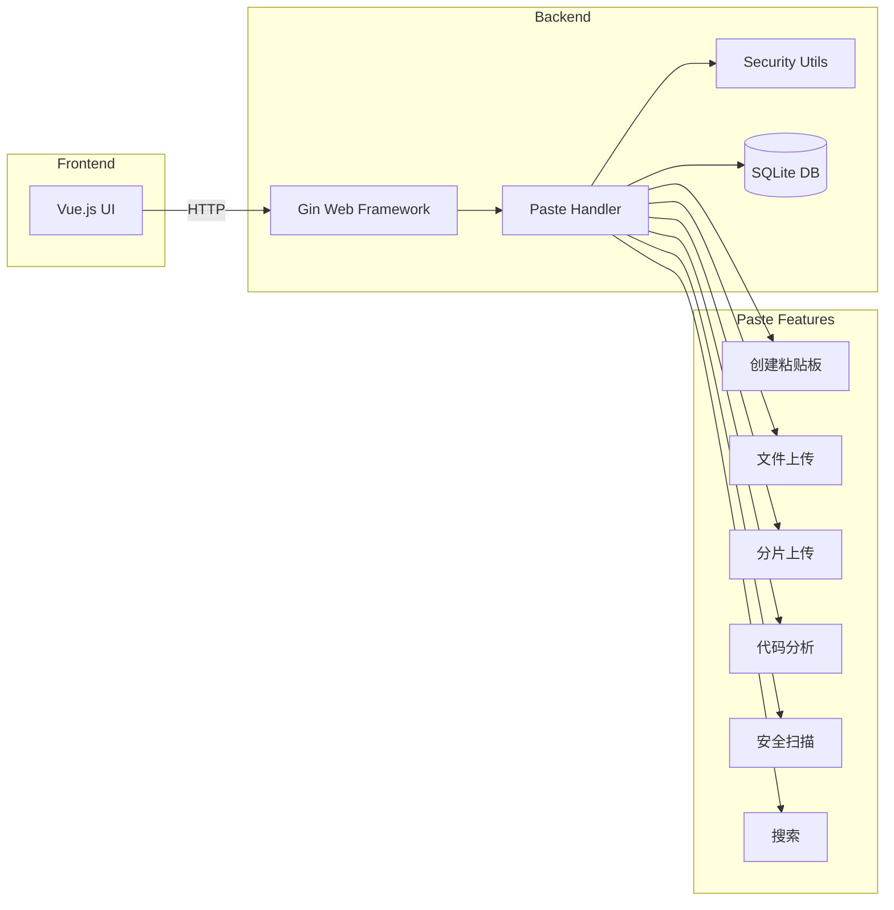

# 任务完成报告

**任务**: 深度优化粘贴板，支持多种文本、代码等内容上传、查看，保证安全，编写单测，构建发布 Docker
**完成时间**: 2026-03-13

## 交付物

| 文件 | 说明 |
|------|------|
| `backend/handlers/paste.go` | 粘贴板核心处理器 - 增强功能 |
| `backend/handlers/paste_test.go` | 粘贴板测试用例 - 完善单测 |
| `backend/models/paste.go` | 粘贴板数据模型 |
| `backend/main.go` | 添加新路由 |
| `Dockerfile` | Docker 构建文件 |
| `devtools:latest` | Docker 镜像 (246MB) |

## 完成情况

### 1. 功能增强
- [x] 支持更多编程语言检测 (60+ 语言)
- [x] 支持更多内容类型 (text, code, markdown, json, html, xml, sql, log)
- [x] 增强文件类型检测 (图片、视频、音频、文档、压缩包、代码)
- [x] 新增 API:
  - `GET /api/paste/languages` - 获取支持的语言列表
  - `GET /api/paste/content-types` - 获取支持的内容类型
  - `GET /api/paste/stats` - 获取统计信息
  - `GET /api/paste/search` - 搜索粘贴板
  - `POST /api/paste/scan` - 内容安全扫描
  - `GET /api/paste/validate/:file_id` - 文件安全验证
  - `GET /api/paste/analyze/:file_id` - 代码分析

### 2. 安全性增强
- [x] XSS 安全检查 - 检测潜在攻击
- [x] 内容安全扫描 - 检测恶意代码模式
- [x] 文件名安全验证 - 防止路径遍历
- [x] 文件扩展名白名单 - 仅允许安全文件类型
- [x] 可疑 URL 检测 - 防止钓鱼攻击

### 3. 测试覆盖
- [x] 语言自动检测测试 (JavaScript, Python, Go, Markdown 等)
- [x] 内容类型测试 (JSON, XML, HTML, SQL, Bash, TypeScript, Dockerfile, YAML)
- [x] 密码保护测试
- [x] 过期功能测试
- [x] 访问次数限制测试
- [x] 内容大小限制测试
- [x] 新增 API 测试 (GetSupportedLanguages, GetSupportedContentTypes, GetStats, ScanContent, SearchPastes, FileCategoryInfo)
- [x] 所有测试通过 ✓

### 4. Docker 构建
- [x] 使用代理构建成功
- [x] 镜像大小: 246MB
- [x] 包含前端 (Vue) 和后端 (Go)

## 如何使用

### 运行 Docker 镜像
```bash
docker run -d -p 8082:8082 -v /path/to/data:/app/data devtools:latest
```

### API 使用示例

#### 创建粘贴板
```bash
curl -X POST http://localhost:8082/api/paste \
  -H "Content-Type: application/json" \
  -d '{"content": "console.log(\"Hello\");", "language": "javascript"}'
```

#### 获取支持的语言
```bash
curl http://localhost:8082/api/paste/languages
```

#### 扫描内容安全
```bash
curl -X POST http://localhost:8082/api/paste/scan \
  -H "Content-Type: application/json" \
  -d '{"content": "function test() { return 1; }"}'
```

#### 搜索粘贴板
```bash
curl "http://localhost:8082/api/paste/search?keyword=javascript"
```

## 整体架构图



## 过程摘要

### DISCOVER
- 分析了现有 paste 功能的代码结构
- 查看了现有的安全检查、语言检测、文件处理等模块
- 确认了现有功能已支持文本、代码、markdown 等内容

### DEFINE
- 核心问题：需要增强粘贴板功能，支持更多内容类型和安全检查

### DESIGN
- 增强语言检测：添加 60+ 编程语言支持
- 增强内容安全：添加 XSS 检测、恶意代码扫描
- 增强 API：添加搜索、统计、验证等公开 API
- 完善测试：添加新功能的单元测试

### DO
1. 增强 `paste.go`:
   - 添加更多支持的语言
   - 添加文件分类信息
   - 添加新的 API 端点
   - 增强安全扫描

2. 增强 `paste_test.go`:
   - 添加新 API 的测试
   - 修复语言检测的测试
   - 所有测试通过

3. 构建 Docker:
   - 使用代理构建成功
   - 生成 246MB 的镜像

### REVIEW
- 所有单元测试通过 (25+ 测试用例)
- Docker 镜像构建成功
- 代码编译无错误
