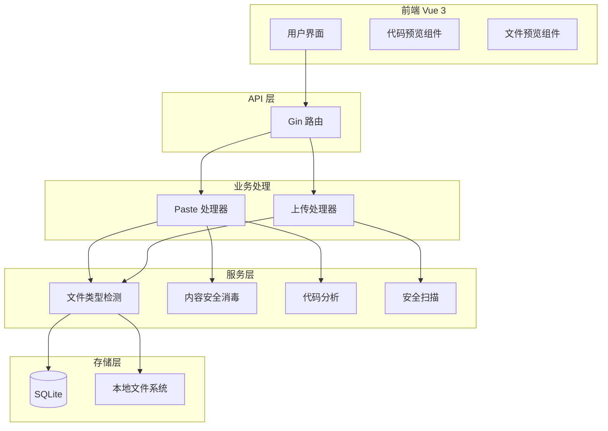
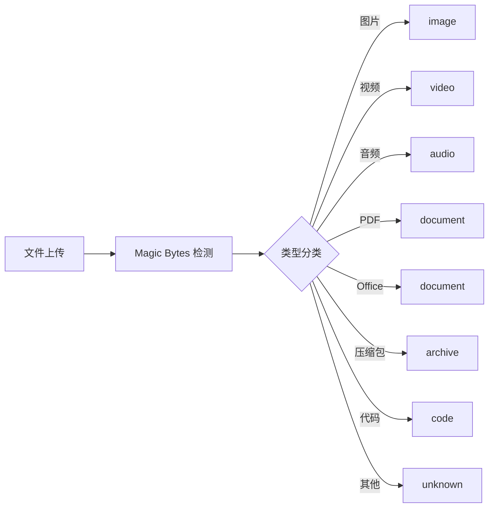
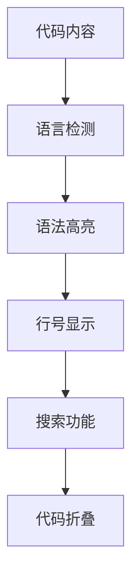
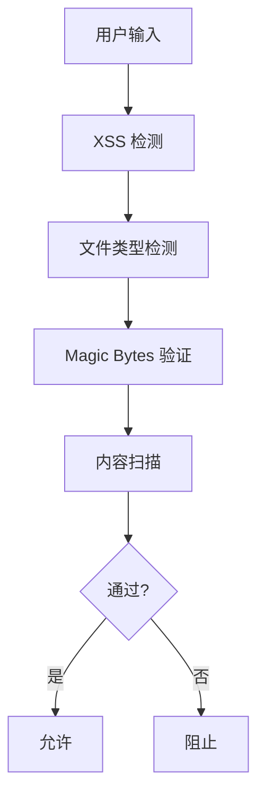

# DESIGN - 解决方案设计

## 方案选型

### 可选方案

**方案 A：全功能增强方案**
- 后端：支持 PDF、Office 文档、压缩包等多种文件类型，增加安全扫描模块
- 前端：代码预览增强（行号、折叠、搜索），新增文件预览组件
- 复杂度：高，需要引入多个第三方库

**方案 B：渐进增强方案（推荐）**
- 在现有架构基础上逐步增强：
  1. 扩展后端文件类型检测和分类
  2. 增强前端代码预览组件
  3. 完善安全检查和测试
- 复杂度：中，渐进式开发，风险低

**方案 C：最小可行方案**
- 仅增强代码预览功能
- 复杂度：低，功能有限

### 选择理由

选择 **方案 B**（渐进增强方案），理由如下：
1. **符合奥卡姆剃刀**：在现有架构上做最小改动，避免过度设计
2. **风险可控**：渐进式交付，逐步验证
3. **资源适配**：单机组部署，存储有限，需要逐步扩展
4. **测试友好**：每个功能模块独立测试验证

---

## 架构/结构设计

### 整体架构图

### 核心模块设计

#### 1. 文件类型检测模块

#### 2. 代码预览增强

#### 3. 安全防护层

---

## 执行计划

### 步骤 1：后端文件类型扩展

**目标**：支持更多文件类型检测和分类

**任务**：
- [ ] 1.1 扩展 `detectFileType` 函数，支持以下类型：
  - PDF (application/pdf)
  - Office 文档 (doc, docx, xls, xlsx, ppt, pptx)
  - 压缩包 (zip, rar, 7z, tar, gz)
  - 更多代码类型
- [ ] 1.2 新增 `getFileCategory` 函数，返回分类：
  - `image`, `video`, `audio`, `document`, `archive`, `code`, `unknown`
- [ ] 1.3 扩展 `FileMetadata` 结构，增加预览支持字段

### 步骤 2：后端安全增强

**目标**：增强安全检查，防止恶意文件上传

**任务**：
- [ ] 2.1 新增恶意文件内容扫描（ClamAV 或简化特征码检测）
- [ ] 2.2 新增恶意链接检测（文本内容中的可疑 URL）
- [ ] 2.3 增强文件扩展名白名单验证

### 步骤 3：后端代码分析

**目标**：提供代码内容分析功能

**任务**：
- [ ] 3.1 新增代码行数统计 API
- [ ] 3.2 新增代码语言精确检测（多种语言混合时）
- [ ] 3.3 新增代码片段摘要生成

### 步骤 4：前端代码预览增强

**目标**：提升开发者查看代码的体验

**任务**：
- [ ] 4.1 集成 Monaco Editor 或 highlight.js
- [ ] 4.2 实现行号显示功能
- [ ] 4.3 实现代码搜索功能 (Ctrl+F)
- [ ] 4.4 实现代码折叠功能（可选）

### 步骤 5：前端文件预览组件

**目标**：支持多种文件类型的在线预览

**任务**：
- [ ] 5.1 新增图片预览组件（支持缩放）
- [ ] 5.2 新增 PDF 预览组件（使用 pdf.js）
- [ ] 5.3 新增压缩包内容查看组件
- [ ] 5.4 文件列表 UI 优化

### 步骤 6：单元测试完善

**目标**：保证核心模块可用

**任务**：
- [ ] 6.1 后端文件类型检测测试（覆盖所有新增类型）
- [ ] 6.2 后端安全扫描测试
- [ ] 6.3 后端代码分析测试
- [ ] 6.4 前端组件测试（Vitest）

### 步骤 7：构建发布

**任务**：
- [ ] 7.1 运行测试确保通过
- [ ] 7.2 使用发布脚本构建 Docker 镜像
- [ ] 7.3 部署上线

---

## 风险预判

### 可能遇到的问题及应对方式

| 风险 | 影响 | 应对方式 |
|------|------|----------|
| 文件类型误检测 | 文件无法预览 | Magic Bytes + 扩展名双重验证 |
| 大文件预览性能 | 预览卡顿 | 使用流式加载，限制预览大小 |
| 安全扫描耗时 | 上传变慢 | 异步扫描，或使用简化检测 |
| PDF.js 引入体积大 | 首屏加载慢 | 按需加载，只在需要时加载 |
| 存储空间不足 | 上传失败 | 自动清理过期文件，限制单文件大小 |

### 关键依赖

| 依赖 | 用途 | 备选 |
|------|------|------|
| highlight.js | 代码高亮 | Prism.js, Monaco Editor |
| pdf.js | PDF 预览 | PDFObject, react-pdf |
| ClamAV (可选) | 恶意文件扫描 | 简化特征码检测 |
